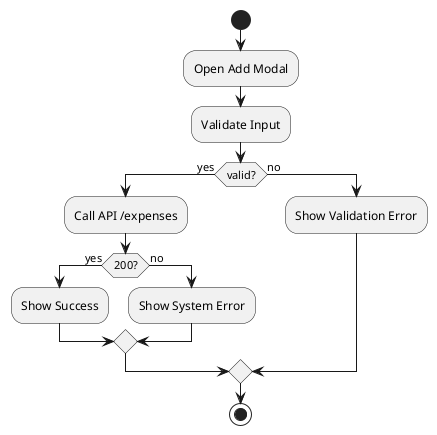

# 📦 Phase 3 – رسم خريطة الطريق (Flowchart) 

## 🎯 الهدف

تأكيد أن كل مسار مستخدم (happy path) وكل فرع للأخطاء مُصوَّر بوضوح، مع توضيح من يقرر حل التعارضات، وكيفية ربط المخطط إلى القوالب التنفيذية (Pseudo‑code, Tests, Issues).

---

## 3.0 – مخرجات Phase‑3 (مباشر قابل للنسخ)

* `docs/flowcharts/us-01-add-expense.drawio` (الملف الأصلي).
* `docs/flowcharts/us-01-add-expense.svg` (تصدير صورة).
* `docs/phase-3-flowchart.md` (هذا الملف).
* Mapping table: `docs/traceability/flow-to-pseudocode.md` (يوضح الربط بين كل مربع/خطوة وملف pseudo‑code ذو الصلة).

---

## 3.1 – قالب Flowchart (نقاط أساسية)

* **Start / End**: دائرتان (Start, End).
* **Process**: مربع يُستخدم لخطوات مثل "Open Modal" أو "Validate Input".
* **Decision**: Diamond — شرط يؤدي إلى فرعين (Yes/No).
* **External System / API**: شكل مستطيل مائل أو قاعدة بيانات.
* **Error / Exception path**: عادة يظهر بلون مميز (error color) ويؤدي إلى عمليات retry، logging، أو عرض رسالة للمستخدم.

**قواعد توثيق:**

* كل Decision يجب أن يُحدد شرطه كتابيًا (مثلاً: `is_amount_valid?`).
* على كل مسار إظهار الـ Owner (مثلاً: `→ Dev/QA`) عند الحاجة لاتخاذ إجراء إنساني.
* ربِط كل node بمعرّف Issue/PR إن وُجد (مثلاً: `#123`).

---

## 3.2 – مثال: Flowchart لـ US‑01 (Add Expense)

(نص موجز يصف المخطط الكامل — ارسم في draw.io باستخدام الملف الموصوف)

1. **Start** → [Open AddExpenseModal] → [User Enters Data]
2. → [Validate Input]

   * ❌ Invalid → [Show ValidationErrorToast] → (End)
   * ✅ Valid → [Call API POST /expenses]
3. → [API Response?]

   * ❌ 5xx or network → [Retry (with backoff) up to 3] → ❌ If still failing → [Log Error & Show SystemErrorToast] → (End)
   * ✅ 200 → [Show SuccessToast] → [Refresh Expense List / Update Cache] → (End)

**Decision Points (Diamonds)**

* `Validate Input`: شرط = جميع الحقول صالحة؟ (owner = Dev/QA)
* `API Response`: شرط = status == 200؟ (owner = DevOps/SRE for infra errors)

**Error branches**

* Validation errors: تُعرض للمستخدم مع focus على الحقول.
* API failures: تُجري محاولة Retry تلقائيًا إن كان خطأ شبكي (retry policy واضحة)؛ إذا فشل تُفتح تذكرة خطأ تلقائيًا (sentry + create issue template).

---

## 3.3 – Decision Matrix & Escalation Rules (قالب)

| Decision Point | Condition              | Yes →             | No →            | Owner  | Escalation (if unresolved)                          |
| -------------- | ---------------------- | ----------------- | --------------- | ------ | --------------------------------------------------- |
| Validate Input | all fields valid       | Call API          | Show validation | Dev/QA | If ambiguous rules → escalate to PO within 24h      |
| API stable?    | error rate > threshold | Investigate infra | retry           | SRE    | If >1h unresolved → on‑call escalation to Tech Lead |

**قواعد:**

* أي قرار فني يؤثر على DoD / SLO يجب أن يُوافق عليه Tech Lead + SRE.
* أي خلاف في تفسير المتطلبات يُرفع إلى PO خلال 24 ساعة.

---

## 3.4 – ربط Flowcharts بالـ Pseudo‑code وTests (Traceability)

* لكل node في المخطط ضع معرّفًا فريدًا (مثلاً `N1`, `D2`)، ثم في `docs/traceability/flow-to-pseudocode.md` اربط `N1 -> pseudo/add_expense.md#step-1` و`N2 -> tests/features/add_expense.feature`.
* هذا يضمن أن أي تغيير في المخطط ينعكس على الاختبارات وPseudo‑code.

**Template للربط (CSV / Markdown Table)**

| Node ID | Node Label     | Linked File                      | Linked Line/Section |
| ------- | -------------- | -------------------------------- | ------------------- |
| N1      | Open Add Modal | `docs/pseudocode/add_expense.md` | Section 1.0         |

---

## 3.5 – أدوات ورسومات مقترحة

* **draw.io / diagrams.net** — حفظ بصيغة `.drawio` و`svg` و`png` في `docs/flowcharts/`.
* **PlantUML** — مفيد لرسم مخططات قابلة للـ version control نصيًا.

**PlantUML snippet (مثال مبسّط):**



> يُفضّل استخراج الـ SVG من PlantUML أو draw.io ووضعها في `docs/flowcharts/`.

---

## 3.6 – Mapping to Testing (BDD + Unit Tests)

* لكل فرع سلوك أنشئ Scenario في Gherkin؛ على سبيل المثال:

```gherkin
Scenario: Add expense fails due to API error
  Given the user has valid expense data
  When the API returns 500
  Then the user sees a system error toast
  And no new expense is added
```

* اربط كل Scenario بملف اختبار Unit/Integration مخصص وبتشغيله في CI.

---

## 3.7 – Ownership & Workflow (سير العمل عند وجود اختلاف)

1. رسم المخطط: Designer/PO + Dev (مسؤول).
2. مراجعة المخطط: Tech Lead + QA (مراجعة 15 دقيقة).
3. التحقق من الـ Security flows: Security Reviewer يشمل threat modelling إن لزم.
4. Sign‑off: PO + Tech Lead (وثّق في `docs/signoffs.md`).

---

## 3.8 – Time‑Box (اقتراح)

* اختيار User Story + رسم مخطط أولي: **15–30 دقيقة**.
* إتمام المخططات لكل قصة (incl. error branches): **20–30 دقيقة / story**.
* مراجعة وSign‑off: **15 دقيقة**.

## 3.9 – Definition of Ready (DoR) — Phase‑3

* ✅ كل User Story لديها Flowchart مع كل Decision واضح.
* ✅ كل node مربوط بـ pseudo‑code أو test أو issue.
* ✅ Ownership وEscalation rules موثوقة.
* ✅ Export SVG/PNG مخزن في `docs/flowcharts/`.

## 3.10 – Definition of Done (DoD) — Phase‑3

* ✅ المخططات مرفوعة بصيغتها المصدرية (`.drawio` أو PlantUML) وصيغ الصورة.
* ✅ كل Decision لديه owner ووقت استجابة مُحدَّد.
* ✅ تم ربط كل node بالـ pseudo‑code و/أو BDD scenarios.
* ✅ تم إجراء مراجعة أمان إذا كانت الـ flow تتعامل مع PII أو عمليات حساسة.

